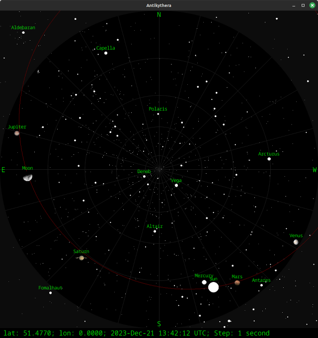

# Antikythera

Antikythera is an interactive sky map inspired by Stellarium.

I use the following approximations:

- All orbits are treated as circular.
- The Earth-Moon barycenter shift is not considered.
- The Moon's direction is calculated from Earth's center.



## Dependencies

To build Antikythera, ensure you have the following dependencies installed:

```
$ sudo apt-get install cargo libsdl2-dev libsdl2-gfx-dev libsdl2-image-dev libsdl2-ttf-dev
```

## Running

Execute from the root directory of the project:

```
$ cargo run
```

## Controls

- Time control: Use the left and right arrow keys to control time within the application.
- Set latitude: Press a followed by a number and Enter to set the latitude.
- Set longitude: Press o followed by a number and Enter to set the longitude.
